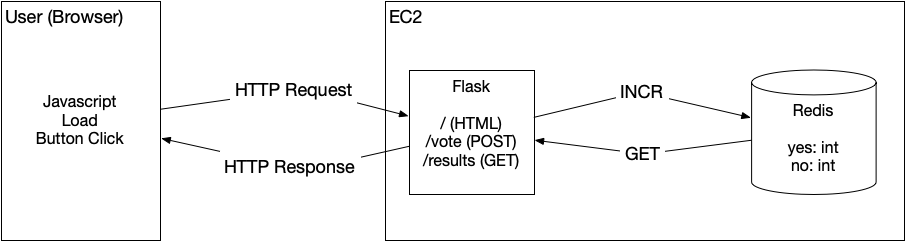

## Overview

This system demonstrates a simple web application based on a Flask/Redis backend and a simple javascript process that runs on the client.



The server allows the user to load a webpage where they can vote "Yes" or "No."  After each vote, the system displays the total number of votes for each option.


## Launch Locally (Development)

To launch the system locally:

* Create a virtual environment and install the libraries

  ```
  python3 -m venv .venv
  source .venv/bin/activate
  pip install -r requirements.txt
  ```
  
* Verify that all tests pass

  ```
  pytest
  ```
    
* Create an `.env` file

  ```
  REDIS_HOST=localhost
  REDIS_PORT=6379
  ```
  
* Run the Redis server

  ```
  docker run -d -p 6379:6379 redis
  ```
  
* Run the Flask server (sudo needed because we launch on port 80)

  ```
  sudo .venv/bin/python app.py
  ```

  Alternate, launch with `gunicorn` (the way we will do in production)
  
  ```
  sudo .venv/bin/gunicorn --bind 0.0.0.0:80 "app:launch_app()"
  ```
  
* Open `http://localhost` in a web browser  


## Launch in Cloud9

* Start a `t3.medium` instance for Cloud9
* Follow the steps from Launch Local
* Edit the Security Group on the underlying EC2 instance
  * Add port `80` on `0.0.0.0/0`
* Open `http://<EC2 IP>` in a web browser


## Launch on EC2 (Console Deployment)

The steps to deploy on an EC2 instance are contained in [`userdata.sh`](userdata.sh).  Study this file, and be sure you understand each line.

* Create an EC2 instance
  * Name: `voting_monolith_console`
  * Key Pair: `vockey`
  * Network Settings: Allow HTTP traffic from the internet
  * Advance Details / User Data - paste in [`userdata.sh`](userdata.sh)
* Connect to the instance

  ```
  ssh -i ~/.ssh/labsuser.pem ec2-user@<instance IP>
  ```
  
* On the instance, watch the deploy via the log

  ```
  tail -f /var/log/cloud-init-output.log
  ```

* Once the message `Cloud-init v. 22.2.2 finished` is displayed, press `ctrl-c` to exit `tail`.

* Open `http://<EC2 IP>` in a web browser


## Launch on EC2 (AWS CLI Deployment)

To launch with the AWS CLI, we specify all settings as command line options.  Before we launch the first time, we must create and configure the security group.

* Create a security group
  ```
  aws ec2 create-security-group --group-name httpssh --description "Security group for HTTP/SSH (80/20) access"
  ```

* Allow HTTP (80)
  ```
  aws ec2 authorize-security-group-ingress --group-name httpssh --protocol tcp --port 80 --cidr 0.0.0.0/0
  ```
* Allow SSH (22)
  ```
  aws ec2 authorize-security-group-ingress --group-name httpssh --protocol tcp --port 22 --cidr 0.0.0.0/0
  ```
* Launch the instance
  ```
  aws ec2 run-instances --image-id ami-06b21ccaeff8cd686 --instance-type t2.micro --key-name vockey --security-groups httpssh --user-data file://userdata.sh --tag-specifications 'ResourceType=instance,Tags=[{Key=Name,Value=voting_monolith_cli}]'
  ```

* Wait for `cloud-init` to complete the `userdata` steps.

* Open `http://<EC2 IP>` in a web browser

